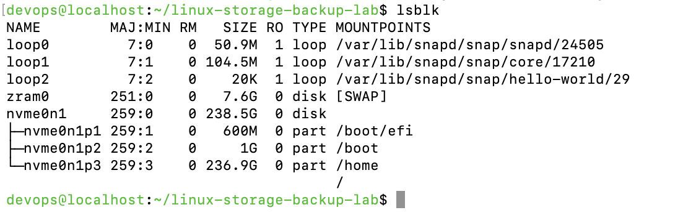
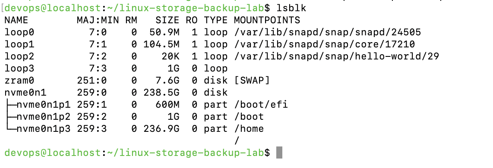
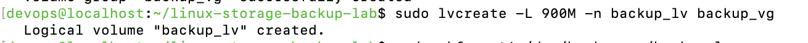
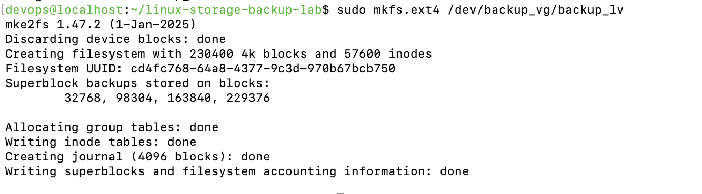
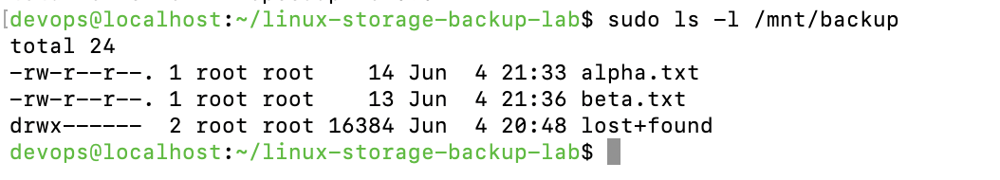
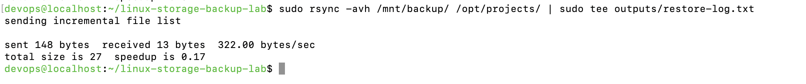
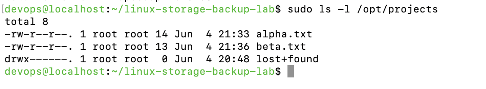

# Linux Storage & Backup Lab 💾
_A real-world lab to master Linux storage management, LVM, `rsync`, and reliable backup/restore operations._

---

## 📌 Objective

This lab simulates a full backup-and-recovery workflow using:

- **LVM** (Logical Volume Manager)
- **`rsync`** for incremental backups
- Mount control for restore points
- Real-world file deletion and recovery

Great practice for anyone preparing for **CompTIA Linux+ (XK0-005)** or day-to-day sysadmin roles.

---

## 🧠 Skills Demonstrated

- Create and manage loopback storage with `dd` and `losetup`
- Provision LVM: PV ➜ VG ➜ LV
- Format and mount volumes (`mkfs`, `mount`)
- Perform safe backups and restores with `rsync`
- Troubleshoot access issues and restore deleted data

---

## 🖥️ Environment

| Component | Version / Tool              |
|-----------|-----------------------------|
| OS        | Fedora 41 (workstation)     |
| Shell     | Bash                        |
| Key CLI   | `losetup`, `lvm`, `rsync`, `mount`, `dd`, `df`, `lsblk` |

---

## 🛠️ Tasks Performed

### 🧱 Disk Provisioning & LVM Setup

```bash
# 1️⃣  Create a 1 GB “disk” file
sudo dd if=/dev/zero of=/opt/backup-disk.img bs=1M count=1024

# 2️⃣  Attach it as /dev/loopX
sudo losetup -fP /opt/backup-disk.img

# 3️⃣  Create the Physical Volume (replace X with actual loop number)
sudo pvcreate /dev/loopX

# 4️⃣  Create VG & LV
sudo vgcreate backup_vg /dev/loopX
sudo lvcreate -L 900M -n backup_lv backup_vg

# 5️⃣  Format & mount
sudo mkfs.ext4 /dev/backup_vg/backup_lv
sudo mkdir -p /mnt/backup
sudo mount /dev/backup_vg/backup_lv /mnt/backup

sudo mkdir -p /opt/projects
echo "Alpha Project" | sudo tee /opt/projects/alpha.txt
echo "Beta  Project" | sudo tee /opt/projects/beta.txt

sudo rsync -avh /opt/projects/ /mnt/backup/

sudo find /opt/projects -type f -exec rm -f {} +

sudo rsync -avh /mnt/backup/ /opt/projects/ | sudo tee outputs/restore-log.txt
```

---

---

## 📄 Output Logs

| File                            | Description                                    |
|---------------------------------|------------------------------------------------|
| `outputs/restore-log.txt`       | Log captured from the `rsync` restore process  |

---

## 📸 Screenshots

### 🔍 Initial Setup & LVM Provisioning

| Step | Description | Screenshot |
|------|-------------|------------|
| 1️⃣  | **Before Loopback Setup** – Disk layout before attaching the backup image |  |
| 2️⃣  | **Loop Device Mounted** – Loopback disk appears after mounting with `losetup` |  |
| 3️⃣  | **LVM Setup: PV Created** – Physical volume initialized with `pvcreate` |  |
| 4️⃣  | **LVM Setup: VG + LV Created** – Volume group and logical volume provisioned |  |
| 5️⃣  | **Filesystem & Mount** – Filesystem formatted and volume mounted to `/mnt/backup` |  |
| 6️⃣  | **Final Layout** – View of the mounted loopback volume using `lsblk` |  |

---

### 💾 Backup & Restore Process

| Phase | Description | Screenshot |
|-------|-------------|------------|
| ✅ Backup Complete | Files `alpha.txt` and `beta.txt` successfully backed up using `rsync` |  |
| ❌ Simulated Failure | Files deleted from `/opt/projects` to simulate data loss |  |
| 🔁 Restore Log | Output of the restore process captured using `tee` |  |
| 🎯 Recovery Verified | Files restored from backup and visible in `/opt/projects` |  |

---

### 📋 Rsync Restore Log Output
Output of the `rsync` command during the restore process, captured using `tee`.


